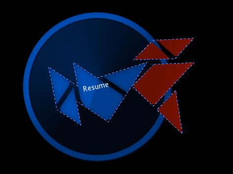
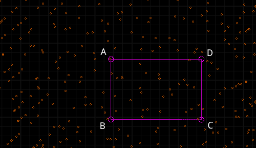
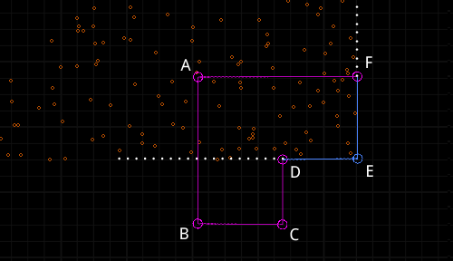
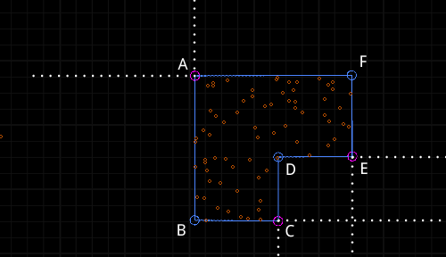
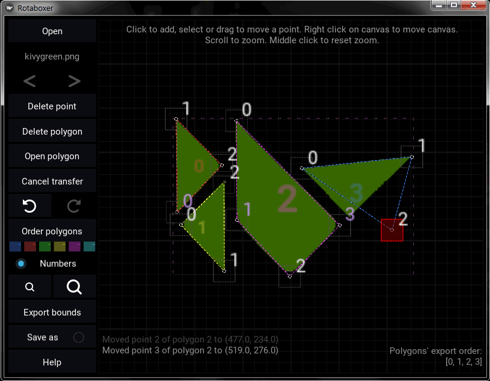

# Rotabox
#### 2D Rotative Collision Detection with Custom Bounds in kivy


*If rotabox.py is run directly, shows an example, where two Rotabox widgets, collide with each other while rotating.*

Rotabox is a *kivy widget* with fully customizable 2D bounds that follow its rotation.  
The users shape their own, specific bounds, to fit an image (or a series of images in an animation), using polygons.  
There's a handy editor for this, available in the package *(See Rotaboxer at the end of this document)*.  

___
## Basic Usage
To use Rotabox, just include *rotabox.py* in your project files.

```python
    from rotabox import Rotabox
    
    rb = Rotabox()
    rb.image = Image(source='img.png')
    rb.add_widget(rb.image)
    rb.custom_bounds = True
    rb.bounds = [[[(0.015, 0.981), (0.019, 0.342), 
                   (0.212, 0.034), (0.21, 0.427), 
                   (0.48, -0.001), (0.714, 0.342), 
                   (0.985, 0.75), (0.462, 0.668), 
                   (0.262, 0.978), (0.265, 0.599)], 
                  [9, 1, 3, 7, 5]]]
```

* Make a Rotabox instance.
* Add an *Image* widget to the instance and assign it to the instance's *image* attribute. 
* Switch the instance's *custom_bounds* flag to *True*. 
* Set the instance's *bounds*:
    * Define a polygon that covers the instance's area that needs to be collision-aware (e.g. its image's opaque area), as a *list* of point tuples *(See API below)*.  
    * Promote some of the polygon's vertices to checkpoints *(See Concept below)* and make a second list with their indices.
    * Put the two lists in another *list* for the polygon.
    * Repeat for additional polygons and put them all in yet another *list* and assign it to the instance's *bounds* attribute *(See API below)*.
 
Use *angle* and *origin* attributes for rotation.  

___
## Concept

To detect membership of a point in a polygon's area, Rotabox uses the polygon's sides in the following manner:
  
Consider a rectangle in a plane full of collision events.



Think of a polygon's vertex (e.g. C in the example) and its two adjacent sides (BC and CD) as a whole (a corner).  
If the vertex is a checkpoint, the corner's legs become rays, extending to infinity.  
A corner like that, divides the whole plane into two regions.  
The checkpoint then, keeps the region containing the polygon and discards the rest.  


The collidable area is what's left when all the checkpoints are done discarding. 


There's no need for the remaining two vertices of the above rectangle to be checkpoints, since their legs are already parts of A and C corners.

#####NOTE: As a general rule, at least one of any two consecutive vertices should be a checkpoint, but they don't both have to be.

In the above example it's just a matter of efficiency, but in certain cases there are vertices that can't be checkpoints.  
Consider the concave polygon below, to see the problem:



Vertices C and E cannot be checkpoints because one of each's legs is crossing the polygon. (e.g. E's horizontal leg excludes the lower part).    
So, starting with D and having to skip C and E, B and F must be checkpoints.  
A, could be a checkpoint too, but it's not required, since its legs are already parts of B and F.



#####NOTE: For a vertex to qualify as a checkpoint, none of its adjacent sides should cross the polygon area if extended.  

More than one polygons can be defined for Rotabox *bounds*.  
So, a complex shape can always be broken into more simple ones.

_______
# API

## Restrictions

* In order to be able to maintain any arbitrary aspect ratio (e.g. its image's ratio), Rotabox doesn't use the *size_hint* property.  
 (Of course, *size* property can always be used in a relative manner  
 e.g. `self.width = self.parent.width * .5`).  
 Also, there's no need to specify a *(None, None)* value for the *size_hint*.

* Rotabox can only have one child. It can be an *Image* but not nesessarily.

## Basics

**image** *Image* (None):  
Rotabox's only child will most likely be an Image.  
If so, it will be assigned to this attribute by default.  
Otherwise, the user can specify an *image* somewhere in the widget's tree, that the custom bounds will use as a reference.  
One can also use an .atlas spritesheet as an animation source and define different bounds for each frame *(See bounds below)*.

**ratio** *float* (0.)  
If *image* is not defined, *ratio* (if provided) can be used to keep the bounds relevant to something else.

**angle** *AliasProperty* (0):  
The angle of rotation.

**origin** *tuple* (center):  
The point of rotation.


## Customizing the Collidable Area

**custom_bounds** *boolean* (False):  
The user will have to enable Rotabox's ability to compensate for
rotation and allow bounds modification.  
With *custom_bounds* enabled, the default settings provide a colliding rectangle, the size of the widget, that follows its rotation.

**bounds** *list* or *dict* (`[[[(0, 0), (1, 0), (1, 1), (0, 1)], [0, 2]]]`)  
This is how the custom bounds are being defined by the user.  
It can be a *list* of one or more polygons' data as seen in its default value, above.  
Here's another example with more polygons:

```python
self.bounds = [[[(0.013, 0.985), (0.022, 0.349),
                 (0.213, 0.028), (0.217, 0.681)],
                [1, 3]],
               [[(0.267, 0.346), (0.483, -0.005),
                 (0.691, 0.316), (0.261, 0.975)],
                [0, 2]],
               [[(0.539, 0.674), (0.73, 0.37),
                 (0.983, 0.758)],
                [2, 0]]]
```

It can also be a *dictionary*, in case of animated bounds (different
bounds for different frames of an animation sequence in an *.atlas* file),
where the *keys* correspond to the frame names in the *.atlas* file and each *item* is a *list* of one or more polygons' data like the above.  
Here's an example of such a *dictionary*:

```python
self.bounds = {'00': [[[(0.201, 0.803), (0.092, 0.491),
                        (0.219, 0.184), (0.526, 0.064)],
                       [1, 3]],
                      [[(0.419, 0.095), (0.595, 0.088),
                        (0.644, 0.493)],
                       [1, 2]]],
               '01': [[[(0.357, 0.902), (0.17, 0.65),
                        (0.184, 0.337), (0.343, 0.095),
                        (0.644, 0.098)],
                       [0, 2, 4]]],
               '02': [[[(...
                        ...
                       ... etc ]]]}
```

Each polygon's data is a *list* consisting of two lists:

* A *list* of point tuples `(x, y)` that constitute the polygon.  
Points' values should be expressed as percentages of the widget's
*width* and *height*, where `(0, 0)` is widget's `(x, y)`, `(1, 1)` is
widget's `(right, top)` and `(.5, .5)` is widget's *center*.


* A *list* of indices, determining which points of the previous
*list*, will be used as checkpoints *{See Consept above)*.
    
**draw_bounds** boolean (False):  
This option could be useful during the manipulation of the widget's
bounds, as it makes the bounds visible and lets the user paint with
the mouse on the collidable areas, to test them.  
There's also a visual editor available in the package *(See Rotaboxer below)*.

## Extra features

**Polygon-specific collision:**  
In a positive collision check, instead of *True*, the number of the colliding polygon is returned (i.e. 1 for the first, 2 for the second, and so on).  
So, if there are more than one polygons, the user can check weather a specific polygon is colliding:

```python
    if self.collide_widget(stone) == 1:
        print("I've been hit in the head!")
```

**Non-Rotabox widgets' classification:** *(Optional)*  
There might be cases where Rotabox will have to determine how a certain *non-Rotabox widget* will be treated (collision-wise).  
Two possible cases are addressed in the code (but out-commended) using the arbitrary flags *bullet* and *platform*.  
#####NOTE: These flags must be defined by the user in said widget.

___
# Rotaboxer
## A visual editor for Rotabox bounds



A convenient way to shape the colliding areas of a Rotabox widget, especially when dealing with multiple frames of a spritesheet animation.  
Open a *.png* image or an *.atlas* file in the editor, work on its bounds and, when ready, copy the resulting code to clipboard for use in a Rotabox widget.

To use it, run *rotaboxer.py* directly. It can be found at the package root.  
